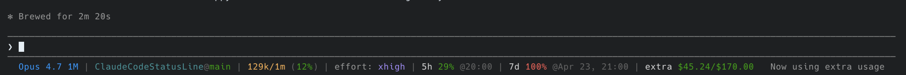

# Claude Code Status Line

A custom status line for [Claude Code](https://claude.com/claude-code) that displays model info, token usage, rate limits, and reset times in a single compact line. It runs as an external shell command, so it does not slow down Claude Code or consume any extra tokens.

> Fork of [daniel3303/ClaudeCodeStatusLine](https://github.com/daniel3303/ClaudeCodeStatusLine) with Windows/PowerShell hardening: reads stdin as UTF-8 and repairs Claude Code's invalid JSON escaping so the line no longer degrades to `Claude | 0%` when the working directory contains non-ASCII (e.g. Korean) folder names, plus reduced statusline flicker by skipping the blocking usage API call when Claude Code already provides rate limits.

## Screenshot



## What it shows

| Segment | Description |
|---------|-------------|
| **Model** | Current model name (e.g., Opus 4.7) |
| **CWD@Branch** | Current folder name, git branch, and file changes (+/-) |
| **Tokens** | Used / total context window tokens (% used) |
| **Effort** | Reasoning effort level (low, med, high, xhigh) |
| **5h** | 5-hour rate limit usage percentage and reset time |
| **7d** | 7-day rate limit usage percentage and reset time |
| **Extra** | Extra usage credits spent / limit (if enabled) |
| **Update** | Appears when a new version is available (checked every 24h) |

Usage percentages are color-coded: green (<50%) → yellow (≥50%) → orange (≥70%) → red (≥90%).

## Installation

Ask Claude Code:

> Clone https://github.com/seung-hr/claude-statusline to `~/.claude/statusline/` (or `%USERPROFILE%\.claude\statusline\` on Windows) and configure it as my status bar by following its INSTALL.md.

Claude will clone the repo to that path, pick the right script for your OS, and update `settings.json`. Full step-by-step instructions Claude follows live in [INSTALL.md](INSTALL.md).

Restart Claude Code after Claude saves the configuration.

### Updating

When the status line shows a new release is available, ask Claude:

> Find my installed status bar and update it.

Or update it yourself:

```bash
git -C ~/.claude/statusline pull
```

No `settings.json` changes are needed — the path stays valid across versions.

## Requirements

- Claude Code with OAuth authentication (Pro/Max subscription for rate-limit and extra-usage data)
- `git` in `PATH`
- macOS / Linux: `jq` and `curl`
- Windows: PowerShell 5.1+ (default on Windows 10/11)

## Caching

Usage data from the Anthropic API is cached for 60 seconds at `/tmp/claude/statusline-usage-cache-<hash>.json` (or `%TEMP%\claude\...` on Windows). Release checks are cached for 24 hours. Both caches are shared across concurrent Claude Code instances to avoid rate limits.

## Update Notifications

The status line checks GitHub for new releases once every 24 hours via an outbound HTTP request to `api.github.com`. When a newer version is available, a second line appears below the status line. The check fails silently if the API is unreachable.

To disable the update check entirely (no network calls):

```bash
export STATUSLINE_CHECK_UPDATES=false
```

## License

MIT — see [LICENSE](LICENSE). Copyright (c) 2025 Daniel Oliveira, retained as required.

## Credits

- **Original author** — [Daniel Oliveira](https://danielapoliveira.com/) ([daniel3303/ClaudeCodeStatusLine](https://github.com/daniel3303/ClaudeCodeStatusLine)). The status line itself — model parsing, token accounting, rate-limit logic, caching, colour thresholds — is his work.
- **This fork** — [seung-hr](https://github.com/seung-hr). Windows/PowerShell hardening only: UTF-8 stdin, invalid-JSON-escape repair for non-ASCII paths, flicker fix, unicode mini-bars. `statusline.sh` is unmodified upstream.
